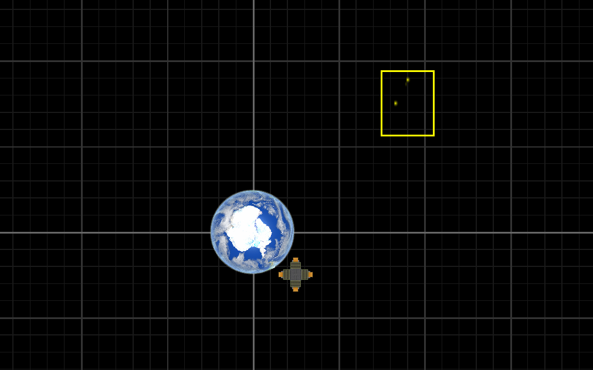

# Special Relativity (SR) Playground

## Installation

You need Python, NumPy, Glumpy, and Pillow.

```sh
pip install glumpy Pillow
```

## Usage

Run `ship.py`. You should get a window like this:



There is a planet, a spaceship, and a light clock. The planet's inertial frame of reference is visualized using a grid. You can use the keyboard to navigate:

**W, A, S, D** - spaceship acceleration

**Spacebar** - stop the spaceship instantly

**E** - toggle whether to show the plane of simultaneity (default), or the past light cone.

**mouse scroll** - zoom in/out

**Plane of simultaneity** is useful to clearly illustrate some special relativity effects. It is not what you would actually see though, because it disregards light travel time. When in this mode, you can notice how:

* The photon clock ticks slower when moving relative to the spaceship. The planet also rotates slower. This can be seen when the spaceship is not accelerating. Acceleration complicates things.
* Objects are contracted in the direction of motion relative to observer. Perpendicular lengths are not changed. If you move at the same speed as the clock, it is not contracted.
* Photons in the clock always travel at light speed relative to observer. This means that they move at varying speeds relative to the clock: they move slowly forwards, and fast backwards.
* If accelerating towards an object, its time is accelerated. If accelerating away, the time is slowed. You can try accelerating away from the planet and back. This explains the twin paradox - the twin on the planet ages when the spaceship turns around.

**Past light cone** is what the spaceship occupants would actually see. It accounts for the amount of time light needs to travel to the observer. When in this mode, notice how:

* Objects moving away are contracted even more, but objects moving closer are elongated.
* Time now passes faster than normal for objects moving closer.
* Photons in the clock travelling straight towards the observer travel instantly. Photons moving away move at half the speed.
* When accelerating away from an object, it gets *closer* before finally moving away.